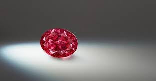

# diamond_image_classifier
image classification using tensorflow( TensorFlow is an open source library for numerical computation, specializing in machine learning applications)
 
I have used transfer learning, which means starting with a model that has been already trained on another problem. Then retrained it on a similar problem. Deep learning from scratch can take days, but transfer learning can be done in short order.  
I have used a model trained on the <b>ImageNet</b> Large Visual Recognition Challenge dataset. These models can differentiate between 1,000 different classes, like Dalmatian or dishwasher.  
  
# Dataset 
        200 Images of Diamond 
        300 Images of Gold Jewellery
# Objective 
  To recongnize whether the given images is of gold or diamond 

# Accuracy Achieved
  After training Model on bottleneck , and keeping number of step as 50 , 
  90% Accuracy is achieved .
# Input
  Image of any size( extension .png , .jpeg , .gif ) 
  example :
  
  
# Output
  

